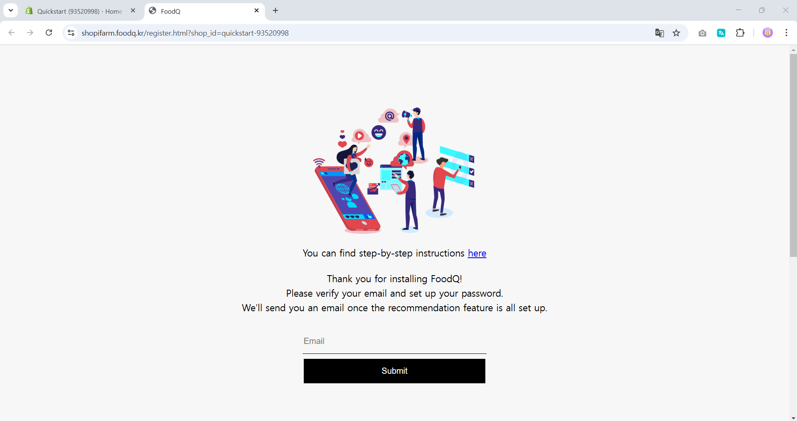
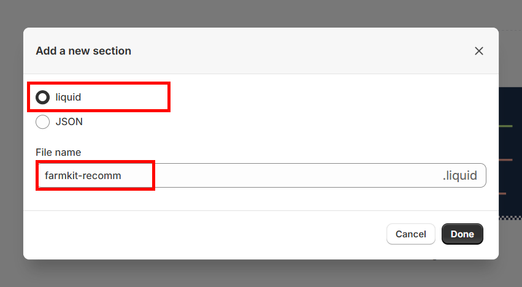

# FoodQ (Food Recommendation AI Service) Shopify Installation Manual

This documentation is for FoodQ by Farmkit, a personalized recommendation service specialized in the food domain.

We provide a detailed guide to help you install our app. Please enjoy it. If you have any questions or encounter any issues with the following steps, please contact help@farmkit.kr.

## Install
First, please click the install button on the installation page.

## Register Your Admin Info
Once the installation is successful, you will be redirected to the sign-up page.

After entering your email address, you will receive a message with your OTP.

Please enter the OTP and click the submit button.

Next, you can set your password and complete the sign-up process by clicking the register button.

You will then be redirected to the login page. Use the email you signed up with to log in. For security reasons, you cannot edit the email address. If you encounter any issues, please contact help@farmkit.kr.

After the initial setup, you might not see any data right away. Don't be discouraged! Once the UI setup is complete and your customers start clicking and making purchases, you'll begin to see the results.

After a few minutes, you will receive a "setup done" message.

## Adding Custom Liquid Code
After installation, navigate to your theme editor.

To start, you need to add a custom liquid code first.

1. Click the "..." button at the top.
2. Then, select "Edit Code."

Then, a new tab will open.

1. Select "Sections."
2. Choose "Add a new section."

Next, select "Liquid" and name it "farmkit-recomm.

An editor will then appear. Remove all the contents and paste the following code.

~~~
 
{{ 'component-card.css' | asset_url | stylesheet_tag }}
{{ 'component-price.css' | asset_url | stylesheet_tag }}

{{ 'component-slider.css' | asset_url | stylesheet_tag }}
{{ 'template-collection.css' | asset_url | stylesheet_tag }}

{{ 'quick-add.css' | asset_url | stylesheet_tag }}

 


{
  "name": "farmkit-recomm",
  "tag": "section",
  "class": "section",  
  "presets": [
    {
      "name": "farmkit-recomm"
    }
  ]
}

~~~

Your liquid editor should then look like the following.

## Setup UI

Now, you're ready to add our recommendation blocks to your pages.

We provide recommendations for three pages: Home, Product, and Cart.

First, go to your home page editor.

Add the `farmkit-recomm` section for a pre-defined design.

1. Add a section in the left pane.
2. Select Sections in the pop-up pane.
3. Select `farmkit-recomm`.

Find a place where you want to add our recommendation block.

1. Find a place to add a block.
2. Check Apps in the pop-up pane.
3. Add "Recommendation for home".

For the product detail and cart pages, repeat the above steps.

1. Add a section in the left pane.
2. Select Sections in the pop-up pane.
3. Select `farmkit-recomm`.

Then,

1. Find a place to add a block.
2. Check Apps in the pop-up pane.
3. For the product page, add "Recommendation for detail". For the cart page, add "Recommendation for cart".

If you have any questions, please contact help@farmkit.kr.